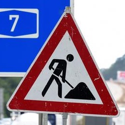
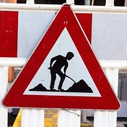
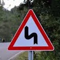
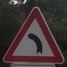
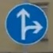
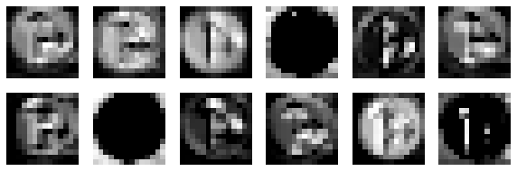
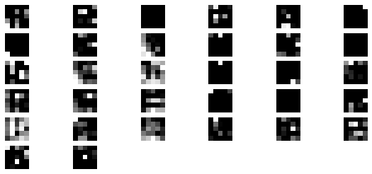

# **Traffic Sign Recognition** 

[//]: # (Image References)

[image1]: ./examples/training_data.jpg "Visualization of Training Data Set"
[image2]: ./examples/validation_data.jpg "Visualization of Validation Data Set"
[image3]: ./examples/test_data.jpg "Visualization of Test Data Set"
[image4]: ./examples/normalization.jpg "Normalization"

In this writeup I will consider the [rubric points](https://review.udacity.com/#!/rubrics/481/view) individually and describe how I addressed each point in my implementation.  

---
## Writeup / README

### 1. Provide a Writeup / README that includes all the rubric points and how you addressed each one. You can submit your writeup as markdown or pdf. You can use this template as a guide for writing the report. The submission includes the project code.

You're reading it! My project code can be found [here](https://github.com/ninemillionbicycles/CarND-Traffic-Sign-Classifier-Project/blob/master/Traffic_Sign_Classifier.ipynb).

## Data Set Summary & Exploration

### 1. Provide a basic summary of the data set. In the code, the analysis should be done using python, numpy and/or pandas methods rather than hardcoding results manually.

I used the the built-in python function `len()` as well as the numpy `shape` attribute to calculate summary statistics of the traffic
signs data set:

* The size of training set is 34799
* The size of the validation set is 4410
* The size of test set is 12630
* The shape of a traffic sign image is (32, 32, 3)
* The number of unique classes/labels in the data set is 43

### 2. Include an exploratory visualization of the dataset.

Here is an exploratory visualization of the different data sets that were used to train, validate and test the model. For each data set the total number of training images per label is shown.

#### 1. Training Data Set: 

![alt text][image1]

#### 2. Validation Data Set: 

![alt text][image2]

#### 3. Test Data Set: 

![alt text][image3]

It can be seen that the number of images per class is relatively similar across all data sets (i.e. the three distributions have similar shapes). Within each data set, there are however larger variations with respect to how many images per class are used for training, validation and testing. This has implications as to how well the model will be trained to recognize certain sign types. 

For example, the specific distributions as shown above indicate that the model will be able to recognize sign types `1`, `2`, `12` or `13` better than sign types `19`, `20`, `21` or `22` as for the former group there are about 2000 images per class used for training while for the latter group there are only about 250 images per class used. 

In general, there will not be equal amounts of data per class available - some sign types are just more common than others. However, a good traffic sign classifier should be able to classify all signs well. A good way to compensate for that might be to augment images of rarer classes by applying affine transformations, such as rotations, translations and shearing and thus artificially collecting more data of the same sign from different angles. A python implementation of this can be found [here](https://github.com/vxy10/ImageAugmentation).

## Design and Test a Model Architecture

### 1. Describe how you preprocessed the image data. What techniques were chosen and why did you choose these techniques? Consider including images showing the output of each preprocessing technique. Pre-processing refers to techniques such as converting to grayscale, normalization, etc.

I implemented a very simple preprocessing pipeline that normalizes all pixels from values `X` in `[0, 255]` to values `X_norm` in `[-1.0, 1.0]` by applying `X_norm = (X - 128)/ 128`.

A random image from the training data set now looks as follows: 

![alt text][image4]

Note that all pixel values are now between `-1.0` and `1.0`.

### 2. Describe what your final model architecture looks like including model type, layers, layer sizes, connectivity, etc.) Consider including a diagram and/or table describing the final model.

My final model consisted of the following layers:

| Layer         		| Description	             					    | 
|-----------------------|---------------------------------------------------| 
| Input         		| 32x32x3 RGB image   							    | 
| Convolution 1       	| Stride = 1x1, Padding = Valid, Output = 28x28x12 	|
| RELU					|									     			|
| Max Pooling	      	| Stride = 2x2, Padding = Valid, Output = 14x14x12 	|
| Convolution 2       	| Stride = 1x1, Padding = Valid, Output = 10x10x32 	|
| RELU					|									     			|
| Max Pooling	      	| Stride = 2x2, Padding = Valid, Output = 5x5x32 	|
| Flatten   	      	| Output = 800                                   	|
| Fully Connected 1    	| Output = 120                                   	|
| RELU					|									     			|
| Dropout				|									     			|
| Fully Connected 2     | Output = 84                                   	|
| RELU					|									     			|
| Dropout				|									     			|
| Fully Connected 3    	| Output = 43                                   	|
| Softmax				|               									|

### 3. Describe how you trained your model. The discussion can include the type of optimizer, the batch size, number of epochs and any hyperparameters such as learning rate.

For training, I used the `tf.nn.softmax_cross_entropy_with_logits` function to calculate the softmax cross entropies between the logits and the labels. I then used `tf.reduce_mean` to calculate the total loss as the mean across all the softmax cross entropies. Finally, I used the [Adam optimizer](https://arxiv.org/pdf/1412.6980.pdf) as implemented in `tf.train.AdamOptimizer` to obtain and apply the weight and bias updates. The Adam optimizer has been empirically shown to work well in practice and compare favorably to other stochastic optimization methods.

I choose the following hyperparameters:
* Number of epochs: `10`
* Batch size: `128`
* Learning rate: `0.0014`
* Dropout probability during training: `0.5`

### 4. Describe the approach taken for finding a solution and getting the validation set accuracy to be at least 0.93. Include in the discussion the results on the training, validation and test sets and where in the code these were calculated. Your approach may have been an iterative process, in which case, outline the steps you took to get to the final solution and why you chose those steps. Perhaps your solution involved an already well known implementation or architecture. In this case, discuss why you think the architecture is suitable for the current problem.

My final model results were:
* Training set accuracy of `0.991`
* Validation set accuracy of `0.955` (peak)
* Test set accuracy of `0.939`

I first started with an adaption of Yann LeCun's LeNet as discussed in Udacity's Self-Driving Car Engineer Nanodegree lecture on Convolutional Neural Networks which performed well on a similar task, namely the classification of handwritten letters. 

After experimenting a bit with various parameters, I found that increasing the filter sizes of the two Convolutional Layers from `16` to `32` and from `6` to `12` respectively results in better validation accuracies. I then added Dropouts after each Convolutional Layer to prevent overfitting. I started off with a learning rate of `0.002` which resulted in fast learning during the first epochs but a very minimal increase in validation accuracy during later epochs. I therefore gradually lowered the learning rate to `0.0014` where the model performed well on both the training and the validation data set. Finally, I evaluated the performance of the model on the test data and got an accuracy of `0.939`.

## Test a Model on New Images

### 1. Choose five German traffic signs found on the web and provide them in the report. For each image, discuss what quality or qualities might be difficult to classify.

Here are five German traffic signs that I found on the web:

<table>
<tr>
<td>  </td>
<td>  </td>
<td>  </td>
<td>  </td>
<td>  </td>
</tr>
</table>

The first two images should be somewhat easy to classify: As there are relatively many images of class `25` in the training data set, the model should be well trained to classify signs of that class. However, both signs might be somewhat more difficult to classify as they both have other signs in the background.

The third and fourth image belong to classes `19` an `21`. They should be more difficult to classify as for both classes there are relatively few images in the training data set.

The fifth image should be somewhere between the first and second and the third and fourth image in terms of how easy it can be classified by the model.

### 2. Discuss the model's predictions on these new traffic signs and compare the results to predicting on the test set. At a minimum, discuss what the predictions were, the accuracy on these new predictions, and compare the accuracy to the accuracy on the test set (OPTIONAL: Discuss the results in more detail as described in the "Stand Out Suggestions" part of the rubric).

Here are the results of the prediction:

| Image			              |     Prediction	        			    | 
|:---------------------------:|:---------------------------------------:| 
| Road work      		      | Road work   							| 
| Road work    			      | Road work								|
| Double Curve			      | Wild animals crossing					|
| Dangerous curve to the left | Dangerous curve to the left				|
| Go straight or right	      | Go straight or right     				|

The model was able to correctly guess 4 of the 5 traffic signs, which gives an accuracy of `0.8`. The accuracy is therefore lower than the accuracy achieved on the test set. However, a total number of 5 images might not be representative.

### 3. Describe how certain the model is when predicting on each of the five new images by looking at the softmax probabilities for each prediction. Provide the top 5 softmax probabilities for each image along with the sign type of each probability. (OPTIONAL: as described in the "Stand Out Suggestions" part of the rubric, visualizations can also be provided such as bar charts)

For the first image, the model is very sure that it shows a road work sign (probability of `1.00000` after rounding) which is the correct prediction. The top five Softmax probabilities were:

| Probability         	|     Prediction	        					| 
|:---------------------:|:---------------------------------------------:| 
| 1.00000         		| Road work  									| 
| 0.00000     			| Dangerous curve to the right 					|
| 0.00000				| Beware of ice/snow							|
| 0.00000      			| Yield				 				            |
| 0.00000			    | Bicycles crossing      						|

For the second image, the model is very sure that it shows a road work sign as well (probability of `0.99988`) which is the correct prediction. The top five Softmax probabilities were:

| Probability         	|     Prediction	        					| 
|:---------------------:|:---------------------------------------------:| 
| 0.99988         		| Road work   									| 
| 0.00008     			| Beware of ice/snow 							|
| 0.00004				| Right-of-way at the next intersection			|
| 0.00000      			| General caution					 			|
| 0.00000			    | Dangerous curve to the right     				|

For the third image, the model is somewhat sure that it shows a wild animals crossing sign (probability of `0.91090`) when it really shows a double curve (probability of only `0.08877`). The top five Softmax probabilities were:

| Probability         	|     Prediction	        					| 
|:---------------------:|:---------------------------------------------:| 
| 0.91090         		| Wild animals crossing   						| 
| 0.08877     			| Double curve									|
| 0.00021				| Dangerous curve to the left					|
| 0.00012      			| Slippery road					 				|
| 0.00000			    | Beware of ice/snow    						|

For the fourth image, the model is sure that it shows a dangerous curve to the left sign (probability of `0.98317`) which is the correct prediction. However, it is somewhat less certain about this prediction that was the case with the first two images. The top five Softmax probabilities were:

| Probability         	|     Prediction	        					| 
|:---------------------:|:---------------------------------------------:| 
| 0.98317         		| Dangerous curve to the left					| 
| 0.01577     			| Double curve									|
| 0.00073				| Slippery road									|
| 0.00025      			| Road narrows on the right						|
| 0.00006			    | Wild animals crossing							|

For the fifth image, the model is sure that it shows a go straight or right sign (probability of `0.99017`) which is the correct prediction. However, it is again somewhat less certain about this prediction that was the case with the first two images. The top five Softmax probabilities were:

| Probability         	|     Prediction	        					| 
|:---------------------:|:---------------------------------------------:| 
| 0.99017         		| Go straight or right   						| 
| 0.00772     			| Turn right ahead								|
| 0.00195				| Ahead only									|
| 0.00015      			| Roundabout mandatory				 			|
| 0.00001			    | Turn left ahead   							|

As assumed a priori, the first and the second image are the easiest ones to classify and the third and fourth image are the hardest ones to classify - in the case of the third image, the prediction even is incorrect.

## (Optional) Visualizing the Neural Network

#### 1. Discuss the visual output of your trained network's feature maps. What characteristics did the neural network use to make classifications?

For visualizing the output of my network's feature maps, I used the following image: 

The first convolutional layer of the network looks as follows:

It looks like the model picks up the signs shape (cells `4` and `8`), the color difference between the sign and the background (cells `1`, `2`, `3` and `11`) and the shape of the arrows on the sign (cells `9` and `12`).

The second convolutional layer of the network looks as follows:

I personally find the second layer very abstract and hard to interpret. 